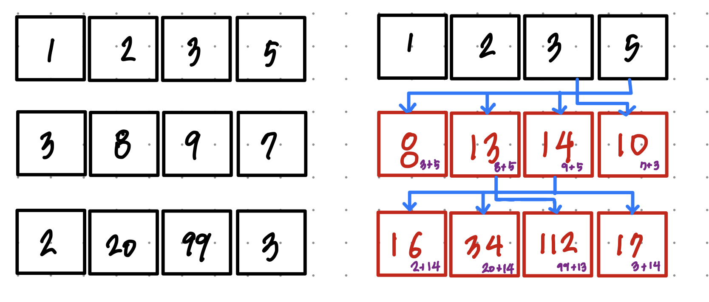

# 땅따먹기 문제

땅따먹기 : https://programmers.co.kr/learn/courses/30/lessons/12913

### 1.이해

- 1행부터 땅을 밟으며 한 행씩 내려오면서 더한 점수 중 최대값을 구한다.
- 단, 연속해서 같은 열을 밟을 수 없다.

### 2.계획

#### 첫번째 풀이

1. `land` 2차원 배열을 하나의 행 씩 순회한다.
2. 하나의 행에 대해서 `최대값`과 `최대값의 index`를 구한다.
3. 최대값의 index는 다음 행에서 연속해서 고르지 않도록 값을 `0`으로 바꿔버린다.
4. 연속되는 열의 값은 0으로 바뀌었기 때문에 최대값을 고를 때 방해되지 않는다.

하지만 이 방법은 아래의 테스트 케이스를 만족하지 못한다.<br>

```javascript
test("예외 케이스", () => {
  expect(
    solution([
      [1, 2, 3, 5],
      [1, 20, 8, 1],
      [1, 99, 3, 1],
    ])
  );
});
```

첫 번째 행에서 `5`를 고르면 다음 행의 `index 3`은 고르지 못한다. 이를 제외한 값 중 가장 큰 값은 `20`이다. 20을 고르면 다음 행의 `99`는 고르지 못하게 된다. 그렇게 되면 `5->20->3` 의 순서로 값을 선택하고 최고 점수는`28`이 될 것이다.<br>
하지만 이 경우 최대값은 `5->8->99`를 고른 `113`이 정답이다. 위와 같은 풀이를 적용하면 당장의 최대값을 골라 더하기 때문에 제대로 된 최대값을 보장할 수 없으므로 틀린 풀이가 된다.

#### 두번째 풀이

너무 오랜 시간 고민하는 것 같아서 다른 사람의 풀이를 참고했다. (결국 내가 생각해내지 못한 것이 너무 싫다...) 이 문제는 DP를 적용하면 쉽게 풀이가 가능하다고 한다.<br>
이 문제의 핵심은 `N행의 각 열은 연속된 열을 제외한 N-1행에서 고른 최대값을 더한 값` 이라는 것이다.<br><br>
아래의 그림과 같은 계산 과정을 거친다.


### 3.실행

- 모든 테스트 케이스와 정확성을 통과한다.

### 4.반성
