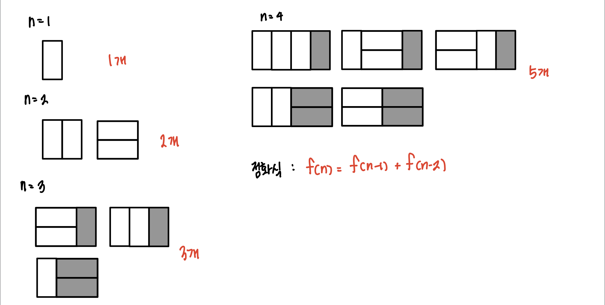

# 2 X N 타일링

문제 링크 : https://programmers.co.kr/learn/courses/30/lessons/12900

### 1. 이해

- 가로 2, 세로 1인 직사각형 모양의 타일로 세로2, 가로 n인 바닥을 가득 채우는 방법의 수를 구하라.

### 2. 계획

- 일단 한번 그려본다.
  
- 그림의 결과는 피보나치 점화식을 나타내고 있다.
- n의 개수가 60000까지 이므로 메모이제이션 기법을 이용해 기존에 구했던 식을 다시 구하지 않도록 하여 시간 초과를 줄여본다.

### 3. 실행

### 4. 반성
